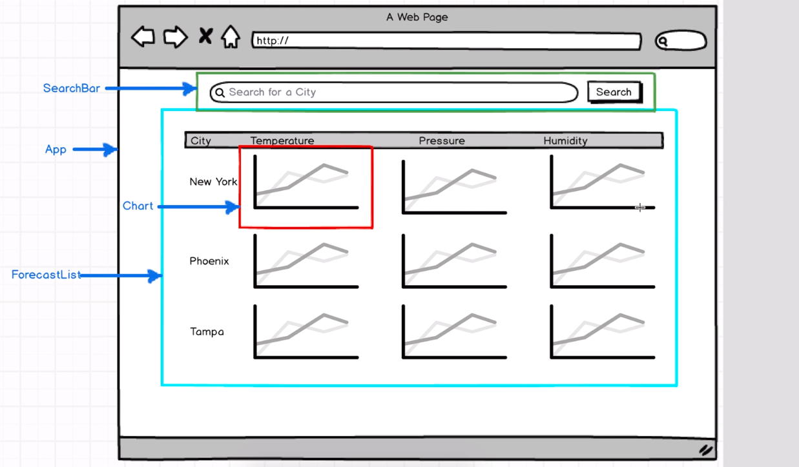
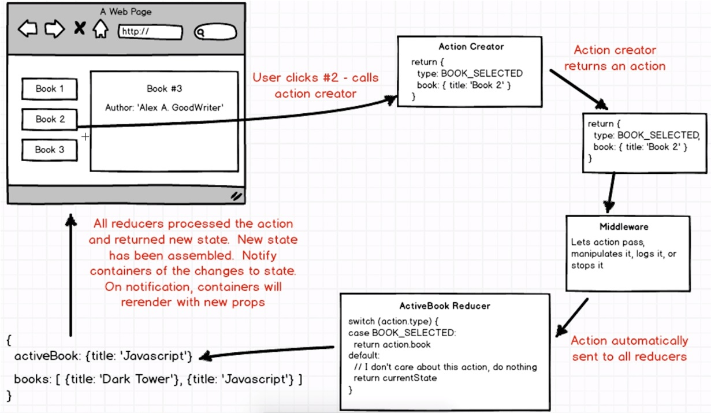

# Weather App

Start from the beginnin as usual, git clone from [online repo of ReduxSimpleStarter](https://github.com/StephenGrider/ReduxSimpleStarter) and install all the dependencies: ```npm install```

Then ```npm start``` and flip to the web browser and check if the line: "React simple starter" is presenting to ensure it works.

<p align="center">
    
</p>

### Component Setup

Firstly, add a container file into src directory: `touch src/container`

We start from creating the search bar: `touch container/search_bar.js`:

```js
import React, { Component } from 'react';

export default class SearchBar extends Component {
    render() {
        return (
            <form className="input-group">
                <input />
                <span className="input-group-btn">
                    <button type="submit" className="btn btn-secondary">Submit</button>
                </span>
            </form>
        );
    }
}
```
Then we need to make sure insert this into the app component as well in order to make it show on the screen. Therefore we flip to `component/app.js`, at the top, we import it from the search_bar file:

```js
import SearchBar from '../containers/search_bar'
```
and replace the text "React simple starter" with `<SearchBar />`

Switch back to the browser, you will find a input bar with a button on the right presenting.

### Controlled Components and Binding Context

After we set up the container, we have to turn it into a controlled field. 

>A controlled field is a form element where the value of the input is set by the state of our component, instead of the other way around. 

>To create a controlled component, we need to set our state whenever the input is changed, and the state here is referring to our component state instead of the redux level state. These two are completely separate.

To set the state up, we need to initialise it inside of our constructor: 

```js
constructor(props) {
    super(props);

    this.state = { term: '' };
}
```
The value of the input is going to be mapped to `this.state.term`.

>Setting default term to be empty string so that when the input first shows up, it's going to be completely empty.

We update the state over time using a change handler on the input. by replacing the original `<input>` with:

```js
<input
    placeholder="Get a five-day forecast in your favourite cities"
    className="form-control"
    value={this.state.term}
    onChange={this.onInputChange}
/>
```
and define the `onInputChange` function below the `constructor`

```js
onInputChange(event) {
    console.log(event.target.value)
}
```
>**Note:** When we don't have something to update the state in `value={this.state.term}`, it never actually gets displayed, so the value when we type in here is going to stay blank. However, as long as someone type in the search bar,  you can find the content being logged in the console. The value of the input comes from `this.state` term. 

We are not updating that state, so it never appears the text in the search bar, but the keypresses do occur in the console log when we type in texts.

In order to fix this by going ahead setting our state whenever we enter some text in there. We enhance the `onInputChange` function: 

```js
onInputChange(event) {
    console.log(event.target.value);
    this.setState({ term: event.target.value })
}
```
>That's the term for holding the current search term is going to be givne target value.

Switch back to the browser and type something into the search bar, you will find the content you typed in displayed into the search bar, however you will find error returned in the console:

```bash
Uncaught TypeError: Cannot read property 'setState' of undefined
```
>**Note:** Whenever we pass off any event handler like this and then call it, the value of `this` is not going to be our search component as a react component, it will be some mystery context hard to interpretate. Because `this` is not the actual component.

To solve this, we can make this an arrow function:

```js
onChange={() => this.onInputChange}
```
or take a different approach to find the context of `onInputChange` in the `constructor`:

```js
constructor(props) {
    super(props);

    this.state = { term: '' };

    this.onInputChange = this.onInputChange.bind(this);
}
```
>**Note:** in the above line, `this` in the right hand side, which is our instance of `SearchBar` has a function called `onInputChange`, `bind` that function to this which is `SearchBar` and then replace `onInputChange` with this new bound instance of function `this.onInputChange` in the left hand side. Basically find the existing instance of `this.onInputChange` and bind and overwrite the local method `this.onInputChange` here.

>**Recap:** if you pass a callback around as a function like `this` in `this.onInputChange` and that callback has a reference to `this` in `this.setState(...)` in `onInputChange()` method, you need bind with the context using: 
>
>```js
>this.onInputChange = this.onInputChange.bind(this);
>``` 
>
>Or otherwise will return a pretty clear error message stating that the program doesn't know what the fuction `setState()` is. Our component only has one reference to `setState` thus it should be relatively easy to track. This rule could apply to other situations, when a function has not been recognised, the first idea come up should be checking binding the context.

### Form Elements in React

> **Note:** If we type something in the search bar and hit submit or hit `Enter` ky, the browser will automatically refresh and submit the form as POST request and the url changed to `http://localhost:8080/?`. This is a unanimous behaviour of all browsers. 

As being a single page application, we need to prevent the page from refreshing all the time and we don't want it to change the html documents. 

We can prevent this behaviour by adding an event handler to the form element. We want to handle the submit event on the form and submit being a very particular key-word here. Following the normal react nomenclature for handling DOM events, we are going to pass a new function handler to the property named `onSubmit`:

```js
onsubmit={this.onFormSubmit}
```
into the `<form>` element and define the function above:

```js
onFormSubmit(event) {
    event.preventDefault()
}
```
> This function at this instance basically tell the browser, don't submit the form. 

Now switch to the browser, type something into the search bar and hit submit, the form is not submitting itself. 

>##### **Thinking:** So why do we use a `<form>` not instead use just  `<div>` element?
>We get free functionalities from using a form, whenever users see a search bar, they have kind of an expectation that they should be able to type something in and then just press enter or hit submit. As being a `<form>` element, we get that behaviour for free so we don't have to set up another event handler to define the behaviour when the user hit the enter or click the submit, try to submit the form.

### Working with API's

At the beginning of this session, let's dive into the investigation of the API we are going to use. We type in [http://openweathermap.org/forecast5](http://openweathermap.org/forecast5)  in the browser. Then we find an API that we can use to grab forecasts and wether data in the next five days for a particular city.  

API call:

```
api.openweathermap.org/data/2.5/forecast?q={city name},{country code}
```
>"q" means query

We can click the sample of London: 
http://samples.openweathermap.org/data/2.5/forecast?q=London,us&mode=xml&appid=b1b15e88fa797225412429c1c50c122a1 
which you should have got somthing returned like the following:

```xml
<weatherdata>
    <location>
        <name>London</name>
        <type/>
        <country>US</country>
        <timezone/>
        <location altitude="0" latitude="39.8865" longitude="-83.4483" geobase="geonames" geobaseid="4517009"/>
    </location>
    <credit/>
    <meta>
        <lastupdate/>
        <calctime>0.0028</calctime>
        <nextupdate/>
    </meta>
    <sun rise="2017-03-03T12:03:03" set="2017-03-03T23:28:37"/>
    <forecast>
        <time from="2017-03-03T06:00:00" to="2017-03-03T09:00:00">
            <symbol number="600" name="light snow" var="13n"/>
            <precipitation unit="3h" value="0.03125" type="snow"/>
            <windDirection deg="303.004" code="WNW" name="West-northwest"/>
            <windSpeed mps="2.29" name="Light breeze"/>
            <temperature unit="kelvin" value="269.91" min="269.91" max="270.877"/>
            <pressure unit="hPa" value="1005.61"/>
            <humidity value="93" unit="%"/>
            <clouds value="scattered clouds" all="32" unit="%"/>
        </time>
        ......
```

> We may notice that this is XML, in order to work with JSON, simply delete `mode=xml&` part in the url, left http://samples.openweathermap.org/data/2.5/forecast?q=London,us&appid=b1b15e88fa797225412429c1c50c122a1 then we should be getting something back like the following:

```JSON
{
    "cod": "200",
    "message": 0.0032,
    "cnt": 36,
    "list": [
    {
        "dt": 1487246400,
        "main": {
            "temp": 286.67,
            "temp_min": 281.556,
            "temp_max": 286.67,
            "pressure": 972.73,
            "sea_level": 1046.46,
            "grnd_level": 972.73,
            "humidity": 75,
            "temp_kf": 5.11
        },
        "weather": [
            {
                "id": 800,
                "main": "Clear",
                "description": "clear sky",
                "icon": "01d"
            }
        ],
        "clouds": {
            "all": 0
        },
        "wind": {
            "speed": 1.81,
            "deg": 247.501
        },
        "sys": {
            "pod": "d"
        },
        "dt_txt": "2017-02-16 12:00:00"
    },
    {

```
After this, we go back to the documentation and sign up and take the API key, and go back to the IDE, open the action folder, In `actions/index.js`, asign this key:

```js
const API_KEY = 'ee74d7e4ba8024a1fc434db577fe8369';
```
and this is the API key we are going to make use of when we make the actual request.

### Introduction to Middleware

We first look at the diagram similar to we have seen before:

<p align="center">
    
</p>

This diagram specify the action creator cycle in a redux application. When user calls the action creator that returns action, the action flows into the reducer, the reducer assemble a new global application state and then that gets injected back into our application. 

>**Note**: Comparing with the previous cycle, we got one more step added into the system, the middleware. **Middleware** is a function that take an action and depending on the actions type and the actions payload or any other number of factors the middleware can choose to let the action pass through, it can manipulate the action before they reach any reducer. We can think of these middlewares as gatekeepers.

This section, we are going to `redux-promise`. Go to https://www.npmjs.com/package/redux-promise, follow the instruction:

```bash
npm install --save redux-promise
```
Then, in root directory `src/index.js`:

```js
import ReduxPromise from 'redux-promise';
```
and we are going apply that middleware by adding it in the first parenthesis of `applyMiddleware()(createStore)`:

```js
const createStoreWithMiddleware = applyMiddleware(ReduxPromise)(createStore);
```

### Ajax Request with Axios

In this section we are going to work on creating actual Ajax request.

Inside `action/index.js`, we are going to create an action creator that is going to be responsible for making an API request to go fetch our weather data. Similarly, we create a new function and export it so it can be used by other files:

>**Note:** Remember action creators always have to return an action and an action is an object which always return an action which always have a `type`:

The last time we created an action creator, the type was a string. This time we try to extract the string in a separate function above the action creator: 

```js
export const FETCH_WEATHER = 'FETCH_WEATHER';

export function fetchWeather() {
    return {
        type: FETCH_WEATHER
    };
}
```
>The purpose of doing so is to keep the action type consistent between our action creators and our reducers. Later this variable will be import to the reducer and we don't have to referencing complicated strings between different files.

To make our API request we need to put together our request URL. Go to weather map and copy the url: http://samples.openweathermap.org/data/2.5/forecast?q=London,us&appid=b1b15e88fa797225412429c1c50c122a1

Switch back to `actions/index.js`, under the line of the definition of `API_KEY`:

```js
const ROOT_URL = 'http://samples.openweathermap.org/data/2.5/forecast?q=London,us&appid=b1b15e88fa797225412429c1c50c122a1';
```
> `http://samples.openweathermap.org/data/2.5/forecast?` is the part of route, domain and path;
> `q=London,us` is the query;
> `appid=b1b15e88fa797225412429c1c50c122a1` is the application id which should be our API key instead. 

We need to clean up the url by:

- Deleting everthing in query part (including `&` sign);
- Delete everything after the equal sign of the `appid`; 
- Add `+ API_KEY` behind the url

```js
const ROOT_URL = 'http://samples.openweathermap.org/data/2.5/forecast?appid=' + API_KEY;
```
Alternatively, we could exploit the ES6 syntax using dollar sign and curly bracket:

```js
const ROOT_URL = `http://samples.openweathermap.org/data/2.5/forecast?appid=${API_KEY}`;
```
After that, by looking at the documentation:

---
API call:
api.openweathermap.org/data/2.5/forecast?q={city name},{country code}
---
we could find that the url consist of `q={city name},{country code}`, thus we pass an argument of `city` into the `fetchWeather()` function. Then we adopt the pattern above into the function by defining `const url`

```js
const url = `${ROOT_URL}&q=${city},us`;
```
> To simplify the process, we make the country code static using `us` for now.

In order to get the url for ajax request, we need to install a package called Axios from ternminal

```bash
npm install --save axios
```
>**Note:** Axios is solely made for making AJAX requests from the browser which works almost identical to Jquery.

Then at the top of the file, we are going to import Axios library

```js
import axios from 'axios';
```
then below `const url`, write the line to get the url above and return a promise:

```js
const request = axios.get(url);
```
Lastly, we are going to pass that request into our action as payload:

>**Note:** payload is an optional property that goes along with actions that can contain some additional data that describes this particular action.

```js
return {
    type: FETCH_WEATHER,
    payload: request
};
```

### Redux-Promise in Practice

Switch back to the search bar file. We first import  several stuff at the top:

```js 
import { connect } from 'react-redux';
import { bindActionCreators } from 'redux';

import { fetchWeather } from "../actions/index";
```
At this stage, switch back to the browser and check if there is error logged in the console.

The goal of this session is to hook up the action creator `fetchWeather` to the `SearchBar` container. Once again, we go to the very below and define the function `mapDispatchToProps(dispatch)`:

```js
function mapDispatchToProps(dispatch) {
    return bindActionCreators({ fetchWeather }, dispatch);
}
```
>**Note:** this cause the action creator whenever it gets called, returns an action `bindActionCreators` make sure that action flows down into the middleware and then the reducers inside of our redux application.

After we have got our `mapDispatchToProps`, we make the `export`:

```js
export default connect(null, mapDispatchToProps)(SearchBar)
```
and delete the `export default` above for the `SearchBar` component


