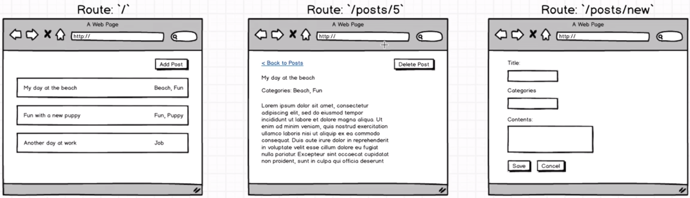
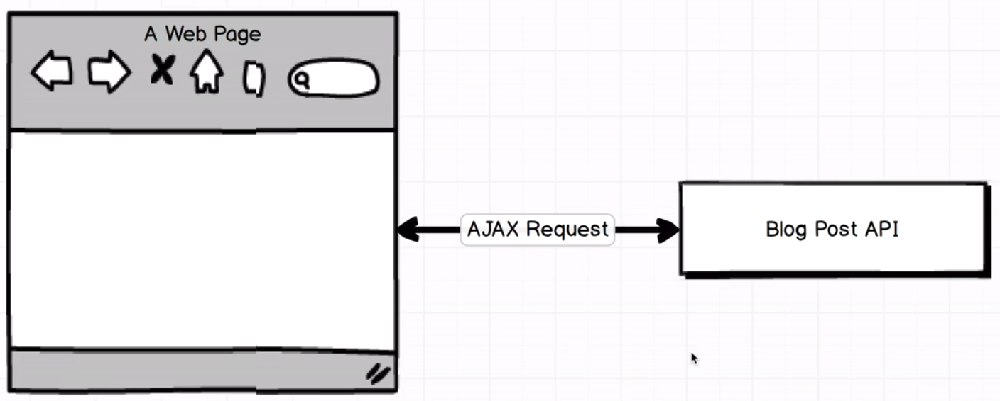

# React Router + Redux Form

This app is going to be a simple blogging application. 

<p align="center">
    
</p>

The first part is what we usually refered to as the index page, a list which shows all the blog posts. Once clicked on one of the blog post, we should navigate to the show page which only shows a single post right in the middle. The user can create new post by clicking the 'Add Post' button on the index page which will take them to kind of compose form where they'll create a new record of a new blog post. As long as the user click the save button, it should save the post and navigate back to the index page. Clicking the cancel page to discard the post should go back to the index page as well. 

> The route at the top: forward slash indicates the home page `/`, 5 in `/posts/5` is the id of the post.

Copy paste the react simple starter, navigate to the repo and `npm install`

<p align="center">
    
</p>

The essence of this application is to save and later retrieve the blog post. By looking at the diagram: When a user visits our page or start up the application, they're going to load up our redux into the web browser. The instant that the application loads up inside their browser, we want to show the user a list o blog, Thus presumably we are going to source or find a list of blog posts to show to the user. To store all these posts, we are going to make use of an API. Inside the browser, the react-redux application will make an AJAX request over to this blog post API, fetching a list of posts and then show them on the screen to the user.

First of all, let's recap on some preliminary knowledge of API. In the browser, go to http://reduxblog.herokuapp.com/. Here are four different basic routes we are going to get access to. https://www.udemy.com/react-redux/learn/v4/t/lecture/6946556?start=0

### React Router

Firstly, install the react router library:

```bash
npm install --save react-router-dom@4.0.0
```

