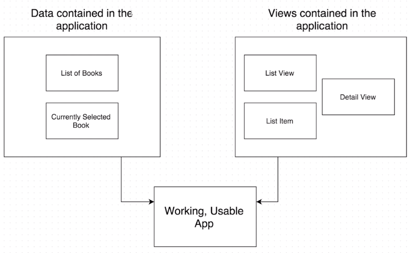
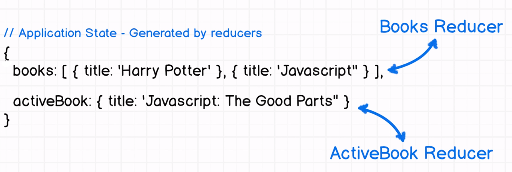
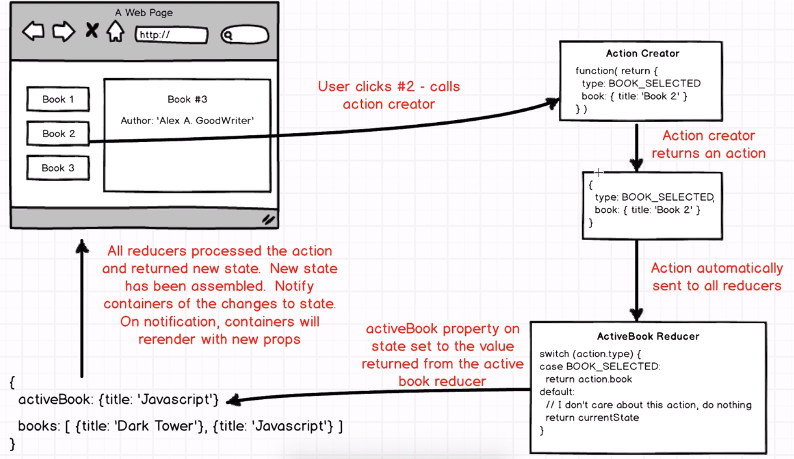

# Managing BookList App with Redux

### Reducers

<p align="center">
    
</p>

We first create file `reducer_books` in `reducers` folder
In the file, we first write a function return array of books:

<p align="center">
    
</p>

```js
function() {
    return [
        { title: "Javascript: The Good Parts", pages: 101 },
        { title: "Harry Potter", pages: 39 },
        { title: "The Dark Tower", pages: 85 },
        { title: "Eloquent Ruby", pages: 1 }
    ];
}
```
Now we have our reducer which is just a function and returns a pice of our application states a list of books and to make use of this reducer aywhere else within our project we need to export this function.

```js
export default function() { ...
```
Then we need to wire into our application, we do this inside `index.js`, following the boilplate code:

```js
import { combineReducers } from 'redux';

const rootReducer = combineReducers({
    state: (state = {}) => state
});

export default rootReducer;
```
We got a key of books and the value is the output of the books reducer

Delete `state: (state = {}) => state`, and mapping the reducer following the boilplate:

```js
books: BooksReducer
```
and import the book reducer file:

```js
import BooksReducer from './reducer_books';
```

### Containers

In order to make sure the code is actually generating usable state for application, we are going to do this by creating a booklist component within react. So we go to the `components` folder and create `book-list.js`:

```js
import React, { Component } from 'react';

export default class BookList extends Component {
    render() {
        return(
            <ul className="list-group col-sm-4">
            
            </ul>
        )
    }
}
```
Now we are going to pull the list building out a separate function called render list inside the unordered list:

```js
{this.renderList()}
```
then we call a new function render list and we are going to wire up the list of books to be on `this.props`

```js
renderList() {
    return this.props.books
}
```
and we'll map over that array and for each element in the array will return an `<li>` with the class name of `"list-group-item"` and inside we put `book.title` and set the key to the unique value of `book.title`:

```js
renderList() {
    return this.props.books.map((book) => {
        return (
            <li key={book.title} className="list-group-item">{book.title}</li>
        );
    });
}
```
Now we to plug in our application state into `this.props.books`. This is a merger that we saw in the previous state diagram when we combine our react views and redux state to generate what we called a usable application. 

>Connecting these two separate libraries reduxand react is done by separate package called react-redux which is already included in this boilerplate package so we can make use of it right away. 

We are going to define one of our components as a container which is a react element that has a direct connection to the state managed by redux. We are going to promote one of these components to a container.

Cut `book-list.js` and paster into the `container`

> A container is just a component that has direct access to the state that's produced by redux. React redux are two separate libraries and it's only through this third library called react-redux that we can forge a connection and mould two together and get a component that's actually aware of the state that is contained within redux.

First thing is to import library on the top:

```js
import { connect} from 'react-redux';
```

Then, we define a function below, whatever returned in this object will be set equal to `this.props` of our component.

```js
function mapStateToProps(state)  {
    // Whatever is returned will show up as props inside of BookList
    return {
        book: state.books
    };
}
```
>`mapStateToProps()` function which acts as a glue is especially key here, the first argument is the state and it returns an object, and whatever object is returned will be available to the component as `this.props`. 
>Whenever the `state` changes, this container will instantly rerender with the new list of books 

At the very bottom we need to actually make use of that connect function, take the component of `mapStateToProps()` and return a container which will be export from this file.

```js
export default connect(mapStateToProps)(BookList);
```

>the `export default` at the very bottom is the container we want to export, and thus deleted the `export default` on the top. `connect` takes a function and a component and produces a container.

### Action & Action Creators

Our books producer always returns the same list of books, in other words our application state is always the same. We don't have the ability to change the state over time due that it's static. In order to implement the states dynamically, we need to bring in a new concept of action creator.

<p align="center">
    
</p>

This is the diagram of the lifecycle of an action and a redux application. Most everything starts with an event triggered by a user either directly or indirectly. This event could be clicking a button, selecting books from dropdown. It can also be indirect like AJAX request finishing loading up or a page initially loading up on the actual web page finishing loading. All of these events can optionally call an action creator. 

An _**action creator**_ is a function that returns an object of actions. The object has a type that describes the type of action that was just triggered. That object has been automatically sent to all the different reducers inside our application. Reducers can choose depending on the action to return a different piece of state depending on what the action is. The newly returned piece of state then gets peped into the application state and then application state then gets pumped back into react application which causes all of our components o re-render.

Create the `actions` directory and touch `index.js`

Now we are going to create a single action creator called `selectBook`. Action creator is just a function 

```js
export function selectBook(book) {
    console.log('A book has bee selected:', book.title);
}
```
Then we need to further connect the component in `BookList` by binding the select book action to this `BookList` component. 

- At the top, we first import the action creator `selectBook`;
- Then we import a library called `bindActionCreators`:

```js
import { selectBook } from "../actions/index";
import { bindActionCreators } from 'redux';
```
>`bindActionCreators` is a function by an action creator is what we are going use to make sure that the action is generated by the action creator actually ends up flowing through all the different reducers.

Next in the bottom just above the export part, we define another function `mapDispatchToProps()`:

```js
function mapDispatchToProps(dispatch) {
    return bindActionCreators({ selectBook: selectBook }, dispatch)
}
```
then we add `mapDispatchToProps` to the argument of the connect function below:

```js
export default connect(mapStateToProps, mapDispatchToProps)(BookList);
```
>Just the same way that `mapStateToProps()` worked, whatever we returned in `mapDispatchToProps` ended up as `props` on our component on our container. In this current case, whatever we pass here in the first argument `{ selectBook: selectBook }` is going to be available as `props` to our container. Now, we've defined this inside of our container, we can call this props `selectBook`specifically.

After that, we add a function to allow us actually call the action creator with the particular book that was clicked on. We add our event handler in the `<li>` tag:

```js
<li
    key={book.title}
    onClick={() => this.props.selectBook(book)}
    className="list-group-item"
>
    {book.title}
</li>
```
Then go to the browser and refresh the page, and  click on the tags representing different books, you will see:

```bash
A book has bee selected: Javascript: The Good Parts
Uncaught Error: Actions must be plain objects. Use custom middleware for async actions.
```
The first line indicates that we successfully connected our action creator to the container.

Now we go to the `actions/index.js` delete the `console.log()` and return an object: 

```js
export function selectBook(book) {
    // selectBook is an ActionCreator, it needs to return an action, an object with a type property.
    return {
      type: "BOOK_SELECTED",
      payload: book
    };
}
```
>**Notes:** actions usually have two values, a type and a payload. The payload further describes and clarifies the conditions of the action that's being triggered every action must have a type that describes the purpose of the action. The action described is a user selecting the book.

<p align="center">
    
</p>

Retrospect to previous diagram, we are now at the stage of creating our active book reducer. Navigate to reducers folder and touch `reducer_active_book.js`:

```js
// State argument is not application state, only the state this reducer is responsible for
export default function(state, action) {

}
```
The state that gets passed as an argument to that books reducer is only the state that was previously generated by the `BooksReducer`, the same state being produced by these reducers is flowing back whenever action occurs.

For example, if we write: `state += 1` into the function, every time an action was triggered the state would be incremented by 1. In this case the state is not an object but a number.

At this stage, simply define the function as:

>In the case which we do care about the action. Most redux reducers are set up with JS switch statements where the switch statement is going to look at the actions type and if it's one we care about, we will return a new state.

```js
export default function(state, action) {
    switch(action.type) {
        case 'BOOK_SELECTED':
            return action.payload
    }

    return state
}
```
>We need to handle the case in which the user first boots the app up and no book is immediately selected. Up to now, it will return state which is undefined. Redux doesn't allow return `undefined` which will return an error. Thus we default our state to null in argument: `(state =  null, action)`. This is a piece of ES6 syntax and basically what it says is when this argument comes in if it's `undefined`, set it to `null`.

After that, our producers need to be connected into the combined reducers statement in `index.js`,  thus we navigate to `./reducers/index.js` file, import `ActiveBook` on the top:

```js
import ActiveBook from './reducer_active_book'
```
and add it into the `combineReducers` object:

```js
const rootReducer = combineReducers({
    books: BooksReducer,
    activeBook: ActiveBook
});
```
>Remeber any key to the object that we provide to `combineReducers` ends up as a key on our global state. 

Go back to the digram again:

<p align="center">
    
</p>

We've now created a reducer that called the book selected action and returns the payload. The selected book will now end up as the value for active book on our state.

Next we are going to flesh out the book detail view which will render whenever there is a selected book. 

>Before we make this book detail, we need to decide whether we are making a component or a container. Containers can touch the redux state directly. We currently know what our book is and we know when it changes, so it makes sense this book detail should be a container.
>
>The `component/app.js` doesn't really care about the active book and the purpose of app is to render the `BookList` and soon the book details to be created. Only the book details cares about the active book.
>
>Therefore we make the active book component a container

Navigate to container folder and touch `book-detail.js`:

```js
import React, { Component } from 'react';

export default class BookDetail extends Component {
    render() {
        return (
            <div>Book Detail!</div>
        );
    }
}
```
Flip back to `component/app.js` and we need to make sure it has been rendered within our application. Import below `BookList`:

```js
import BookDetail from '../containers/book-detail'
```
and in render method add `BookDetail` component:

```js
render() {
    return (
        <div>
            <BookList />
            <BookDetail />
        </div>
    );
}
```
Now flip back to the brower and refresh, we can see **Book Detail!** rendered in the page

After that, we replicate the mapping functions in BookList into BookDetails. First, import the connect function: 

```js
import { connect } from 'react-redux';
```
Then we define the helper function in the bottom:

```js
function mappStateToProps(state) {
    return {
        book: state.activeBook
    };
}
```
>`state.activeBook` here specifically referencing to the `activeBook`  in `reducers/index.js` file. 

Lastly, make sure export the container at the very bottom:

```js
export default connect(mappStateToProps)(BookDetail);
```
>Remeber to remove the `export default` up in `BookDetail` class.

#### Conditional Rendering

Now go back to the book detail file and make use of the object returned in render function:

Take out the placeholder text of "Book Detail!" and type:

```js
return (
    <div>
        <h3>Details for:</h3>
        <div>{ this.props.book.title }</div>
    </div>
);
```
go to the page and refresh, we get this following error returned:

```bash
Uncaught TypeError: Cannot read property 'title' of null
```
>Flip back to `reducer_active_books.js`, 

>**Note:** Whenever application first loaded up, we don't have any existing application state defined yet. Our application state is assembled entirely by all of our reducers. Redux sends a couple of booting up actions through all these reducers. 
>Since the default active `state` has been set to `null`, when our application first boots up, that caused the component `<div>{ this.props.book.title }</div>`(specifically `this.props.book`) in book detail file to be rendered as null. Thus we are trying to read property title of null which returns an error in Javascript.

In order to solve this, we need to add a initial check within the render method before the return:

```js
if (!this.props.book) {
    return <div>Select a book to get started</div>
}
```
and then flip to the browser and refresh, you will see "Select a book to get started" initially defined. If you click on a book, `this.props.book` will return a certain book with `title` property returned.

Now, add one more property `pages` to the `reducer_books.js`:

```js
export default function() {
    return [
        { title: "Javascript: The Good Parts", pages: 101 },
        { title: "Harry Potter", pages: 39 },
        { title: "The Dark Tower", pages: 85 },
        { title: "Eloquent Ruby", pages: 1 }
    ];
}
```
and call it in the book detail component:

```js
return (
    <div>
        <h3>Details for:</h3>
        <div>Title: { this.props.book.title }</div>
        <div>Pages: { this.props.book.pages }</div>
    </div>
);
```
and flip back to the browser and refresh, and click on a certain book. You will see stuff like the below returned on the page:

```
Title: Harry Potter
Pages: 39
```


